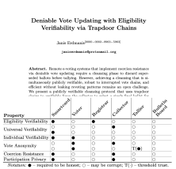
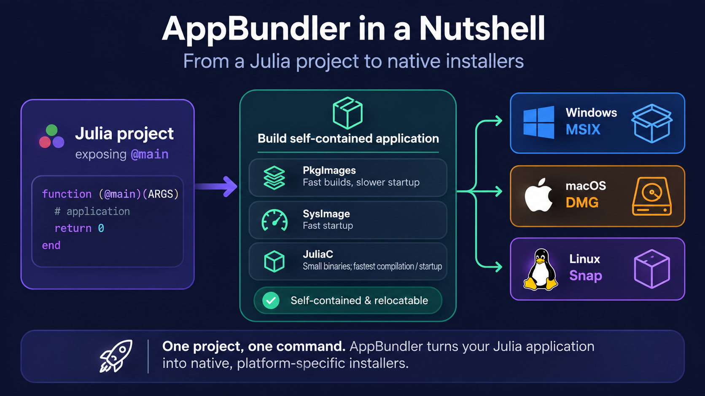
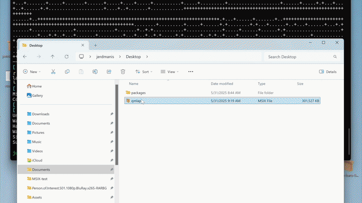
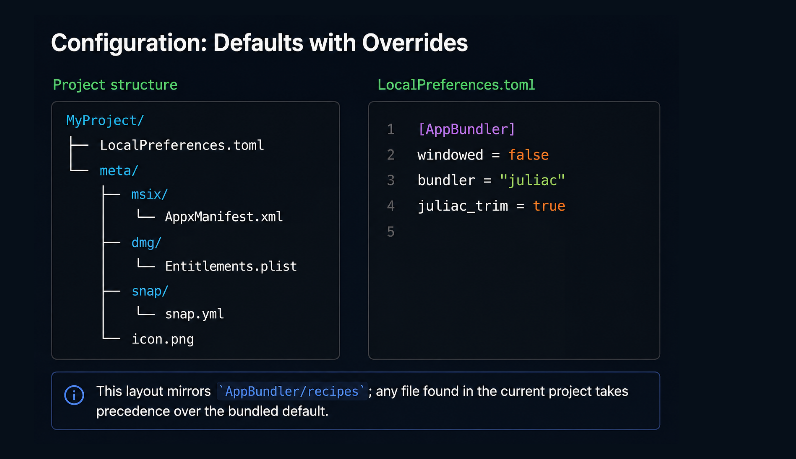

<style>
.ack {
  position: absolute;
  bottom: 40px;
  left: 70px;
  right: 70px;
  font-size: 24px;
  line-height: 1.4;
  opacity: 0.7;
}
</style>

# AppBundler 1.0 - Bundle your Julia application and beyond 

Janis Erdmanis
[janiserdmanis.org](https://janiserdmanis.org)

<div class="ack">

This work is supported by the European Union through the Next Generation Internet initiative ([NGI0 Entrust](https://ngi.eu/ngi-projects/ngi-zero-entrust/)), via the NLnet [Julia-AppBundler](https://nlnet.org/project/Julia-AppBundler/) project.

</div>

---



# About Me

- Physics PhD
- Julia user since v0.3.4
- Presenting at EVoteID this year (hobby)

A few years ago, I wanted to build a prototype
for an e-voting system [peacefounder.org](https://peacefounder.org/downloads/)

That led me to a deployment challenge:

> How do you deploy user-facing GUI applications written in Julia?

And that's how **AppBundler** started.

---

# The Ultimate Solution?

```bash
curl -L https://trust.me/install.sh | sh
```

---

# Why Do We Want Installers?

- **User-friendly experience**
  - Download → install → run
- **Clean:** Install and uninstall without leaving a mess
- **Native:** Icons, shortcuts, file associations, OS integration, performance
- **Sandboxing & Security**
  - Limit application permissions
  - Not as safe as a web page in a browser — but the same spirit 

--- 

# Why is this so hard?

1. Platform-specific tooling
Vendor SDKs, packaging utilities, signing tools
2. Platform-specific behavior
Installation, launch, runtime layout, permissions
3. Application dependencies
What is bundled? What is shared? What is already on the system?
4. Distribution & trust
Signing, notarization, approval, certificates


---



---

# Demo - Counting Words

```julia
module CmdApp

import AppEnv

function (@main)(ARGS::Vector{String})
    AppEnv.init() # initialize runtime environment

    # application logic
    filename = only(ARGS)
    println("$filename: $(word_count(filename)) words")

    return 0
end

export main

end
```

--- 


If your Julia application exposes `@main` and can be launched with `julia --project=. -m MyApp`, it is ready to bundle:

```bash
appbundler build ./examples/CmdApp --build-dir=build --selfsign
```

---

# What AppBundler provides

1. **Relocatable application bundles** — PkgImages · SysImages · JuliaC
2. **Native package formats** — MSIX · DMG · Snap (sandboxing)
3. **Reproducible packaging toolchain** — open source, BinaryBuilder + Yggdrasil, no platform-specific toolchain to maintain
4. **Sensible defaults** — native configuration for targeted customization


<!-- HTML comment recognizes as a presenter note per pages. -->
<!-- You may place multiple comments in a single page. -->

---

# Beyond Julia `@main`

AppBundler isn't limited to one application structure

- **Julia applications** — the standard `@main` entry point
- **Full Julia distributions** — Jumbo Julia
- **Other build systems** — applications can use their own build process

---

# MSIX

**Microsoft tooling**

`StagingDir → MakeAppx → SignTool → MyApp.msix`

- Windows SDK/tooling
- **Licensing prevents redistribution with AppBundler**

**AppBundler**

`StagingDir → msixpack → osslsigncode → MyApp.msix`

- Open-source, redistributable tooling
- Cross-compilable with **BinaryBuilder**


--- 

# MSIX — What's inside the package?

AppBundler assembles this `StagingDir/` before creating the .msix.
- `AppxManifest.xml` — identity, entry point, capabilities
- `resources.pri` — MSIX resource index (fixes ugly icon rendering)
- `Assets/` — application icons
- `Msix.AppInstaller.Data/MSIXAppInstallerData.xml` — installer config
- `MyApp.exe` — application launcher

> ⚠️ AppBundler changes MyApp.exe to the Windows GUI subsystem after compilation. For GUI applications, this currently leaves a zombie console process.

> Sandboxing is configured through `AppxManifest.xml`. The application also requires the UCRT runtime.

---



---

# DMG

**Apple tooling**

`MyApp.app → codesign → hdiutil → codesign → notarytool → stapler`
 
**AppBundler**

`MyApp.app → rcodesign → xoriso → dmg → rcodesign -notarize`
- `dmg` from **libdmg-hfsplus**
- Open-source, redistributable tooling
- Cross-compilable with **BinaryBuilder**

---

# DMG — What's inside the app?

AppBundler assembles the `MyApp.app` bundle before creating the `.dmg`:

- `Contents/MacOS/MyApp` - application launcher
- `Contents/Libraries/main` - binary stub reference
- `Contents/Info.plist`- application metadata
- `Contents/Resources/icon.icns` - application icon
- `../DS_Store` - controls the installer's appearance

> ⚠️ The launcher must be a native binary for code signing. Sandboxing is configured through `Entitlements.plist` and incorporated into the signed launcher.

---


---

# Snap

**Snapcraft**

`snapcraft.yaml → snapcraft → MyApp.snap`

- Open-source, but does not cross compile
- Wants to do compilation for you

**AppBundler**

`StagingDir → mksquashfs → MyApp.snap`

- Open-source, redistributable tooling
- Cross-compilable with **BinaryBuilder**

---

# Snap — What's inside the package?

AppBundler assembles the `StagingDir/` before creating the `.snap`:

- `snap/snap.yaml` — package metadata and configuration
- `bin/MyApp` — application launcher
- `meta/icon.png` — application icon
- `meta/gui/MyApp.desktop` — desktop integration
- `meta/hooks/configure` — configuration hook

---


---



---

# Asset referencing

Compiled code doesn't know it's been moved.

- `@__DIR__` → hardcoded build path → unrelocatable
- `pkgdir(@__MODULE__)/assets` → works with PkgImages + SysImage
- JuliaC → sources gone → `pkgdir` fails

**Fix:** ship an asset index; `AppEnv.init()` repopulates `Base.pkgorigins`

---

# Asset trimming

Sysimage and JuliaC bundles don't need the sources — only the assets. We can select only the assets we need in `LocalPreferences.toml`:
```toml
[AppEnv]
assets = ["LICENSE"]

[QMLApp]
assets = ["src/App.qml"]

[AppBundler]
juliaimg_selective_assets = true
# Other AppBundler options
```

---

# Challenges

---
# Julia does not cross compile
Install GitHub action script:
```
AppBundler.install_github_workflow()
```
and bunlde installers with `macos-latest-x86_64`, `macos-latest-aarch64`, `ubuntu-latest-x86_64`, `ubuntu-24.04-arm-aarch64`, `windows-latest` runners.


---

# Codesigning certificates are expensive
Until then:
```
curl -L https://trust.me/install.sh | sh
```
The `install.sh` script can bootstrap trust of the bundle signer. The app then installs through the normal platform packaging path.

---

# Future Work 

- Flatpak support
- RPM and DEB targets
- Polish — icons, template management, CLI output
- Drop `Quaternions.jl` from the dependency chain
- Self-hosted CLI — no Python `ds_store` dependency
- **Generic API for bundling projects in other languages**

