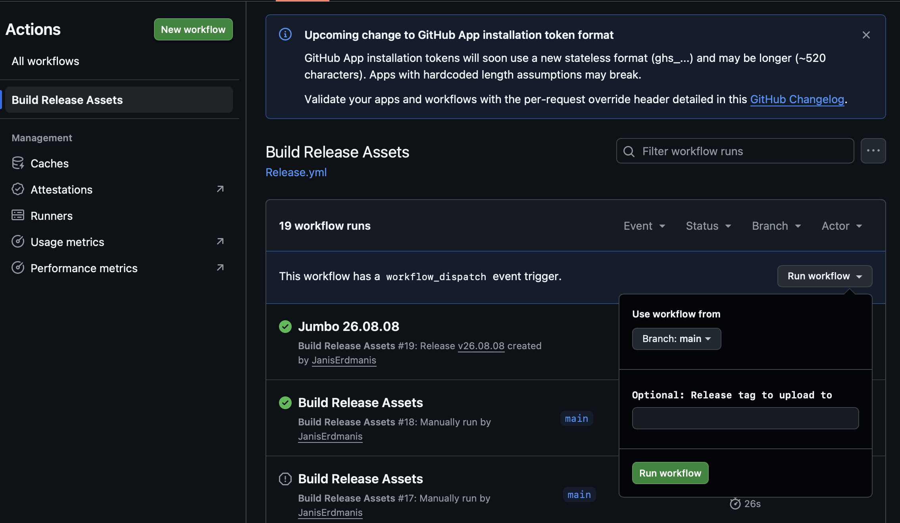
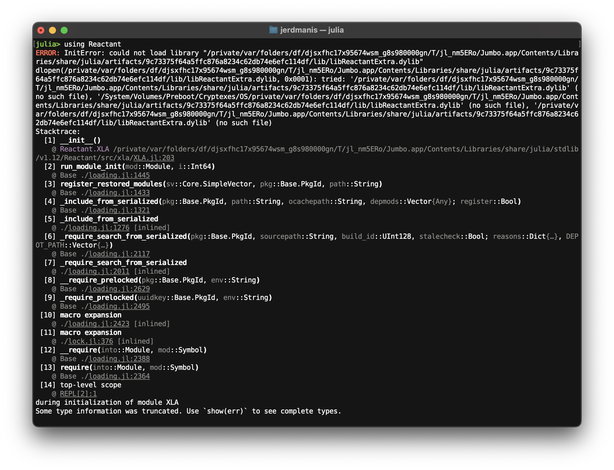

<style>
.ack {
  position: absolute;
  bottom: 40px;
  left: 70px;
  right: 70px;
  font-size: 24px;
  line-height: 1.4;
  opacity: 0.7;
}
</style>

<!-- _paginate: false -->

# Jumbo Julia distribution 

Janis Erdmanis
[janiserdmanis.org](https://janiserdmanis.org)

<div class="ack">

This work is supported by the European Union through the Next Generation Internet initiative ([NGI0 Entrust](https://ngi.eu/ngi-projects/ngi-zero-entrust/)), via the NLnet [Julia-AppBundler](https://nlnet.org/project/Julia-AppBundler/) project.

</div>

---

<video src="compilation-pain.mp4" controls width="100%"></video>


---

## What if we could ship precompiled dependencies just like Julia's standard libraries? 

**`Manifest.toml` + `LocalPreferences.toml` -> AppBundler**

---

# Jumbo is that distribution

**For anyone who wants to open Julia and start working** — students on day one,
scientists who'd rather not manage environments, workshop and classroom setups.

A single installer that ships Julia **plus a precompiled scientific stack**.

- **~532 packages** precompiled and distributed as pkgimages —
  DifferentialEquations, Makie, JuMP, Enzyme, Reactant (WIP), ...
- **No install step, no compilation wait** — `using Makie` costs load time only
- **Windows (MSIX) · macOS (DMG) · Linux (Snap)** — one build pipeline
- Built entirely with **AppBundler.jl**; ~1 GB download

Get it: [github.com/JanisErdmanis/Jumbo](https://github.com/JanisErdmanis/Jumbo/releases/latest)


---

# How is Jumbo built?

This is `LocalPreferences.toml` for Jumbo Julia distribution:
```toml
[AppBundler]
app_summary = "Julia Distribution for Science"
windowed = false
selfsign = true

juliaimg_mainless = true
juliaimg_incremental = true
juliaimg_precompile = true
```
Then compile the distribution with:
```
julia --project=meta -m AppBundler build . --build-dir=build
```


---

# Demo (Lorenz attractor)

<!-- Use terminal command to launch jumbo with the project and the Lorenz attractor -->
<!-- Then start the session. Show project status; add Quantum Optics -->
<!-- Show that Manifest.toml currently is not interoperable with ordinary julia -->
<!-- Show that infiltrator is available -->

---

<video src="jumbo-preview.mp4" controls width="100%"></video>

---

# Custom `startup.jl`

Jumbo Julia ships with a custom startup file `etc/julia/startup.jl`
```julia
import AppEnv 
AppEnv.init() # initializes runtime environment

using Revise
using Infiltrator
```
Runtime environment: `LOAD_PATH`, `DEPOT_PATH`, `Base.pkgorigins`

---

# Challenges

Cross compilation · `compat` bounds · Codesigning · Reactant

---

# Julia does not cross compile

Every target needs a runner of its own — the system image must be built on the platform it will run on.

- macOS, Windows, Linux — **5** GitHub Actions jobs (arm64 + x86_64)
- ~120 min per target; the matrix is the build pipeline
- Runners are free for public repos — this is what makes it tractable


---



<!-- DEMO: GitHub Actions workflow -->

---

# Packages that lag with `compat` bounds

One stale upper bound can pin the whole manifest a version behind.

- **Find them:** indirect dependencies hide the lag; tracing it is manual 
    - How to approach this?
- **Nudge:** open a PR bumping the bound — usually a one-line change
- **Evict:** if unmaintained, drop it from the distribution

<!-- walk through a real example from the Jumbo manifest -->

--- 

# Codesigning is expensive

- macOS notarization requires more work; directory structure
- Windows `.pfx` certificates increasingly live in hardware modules
    - Plan: a Raspberry Pi signing endpoint
- Being tackled under the AppBundler project, with Jumbo as testbed


> ⚠️ Escape hatch — bootstrap trust without a certificate:
> ```bash
>  curl -L https://trust.me/install.sh | sh
>  ```

<!--  `install.sh` only needs to establish trust in the `MSIX` or `DMG`, so it stays small and auditable. -->

--- 

# Reactant

- Hardcoded paths
- Great for a Hackathon



---

# Hackathon: ship distributions via `juliaup`

Install with `juliaup` and the codesigning problem disappears. For that we need:

- **JuliaUp database package** — append releases programmatically
- **Compatable Images** — AppBundler emits a tree `juliaup` accepts
- **Glue** — Actions: database on Pages, updated when the matrix finishes

**Open:** convergence with Dyad and upstream Julia distribution workflow; repackaging of compiled tarballs into installers. 

--- 

# Try it

**Download:** [github.com/JanisErdmanis/Jumbo/releases](https://github.com/JanisErdmanis/Jumbo/releases)

**Build your own distribution:** `AppBundler.jl` — pick a `Manifest.toml`, set three preferences, ship an installer

**Where help is wanted:**
- macOS notarization pipeline
- Packages with stale `compat` bounds
- Reactant's hardcoded paths

Janis Erdmanis · [janiserdmanis.org](https://janiserdmanis.org)

---

<!-- _paginate: false -->

# Appendix

---

<!-- _paginate: false -->

# Speculative: could Jumbo ship as a Pkg app?

Delivered through `juliaup` rather than platform installers — roughly how
Julia-Dyad is distributed.

- **Blocker:** Pkg apps have no pkgimage distribution story, and the
  precompiled images are the whole point here
- **Sketch:** `@main` sets up `LOAD_PATH` and `DEPOT_PATH`, then hands off
  to the REPL — pkgimage invalidations might make this fragile
- **If it worked:** no codesigning, no notarization, no per-platform installer

Noted as a possible alternative — not a direction I'm pursuing.

---

# Convergence with the Dyad distribution workflow

[JuliaComputing/create-julia-distribution](https://github.com/JuliaComputing/create-julia-distribution)

Same goal: **shipping a curated Julia to end users.**

- **Dyad brings** juliaup integration; builds through `PackageCompiler`
- **AppBundler brings** GitHub release-based hosting and a tunable sysimage/pkgimage boundary
    - No `PackageCompiler` dependency — functionality reimplemented, pkgimages layered on top, `Base.Linking` used in place of a compiler toolchain

**Lessons to take:** Apple code signing, done properly so the tree can pass notarization once wrapped in a DMG. `Base.pkgorigins` rewrite is a different strategy and worth investigating. 

---
