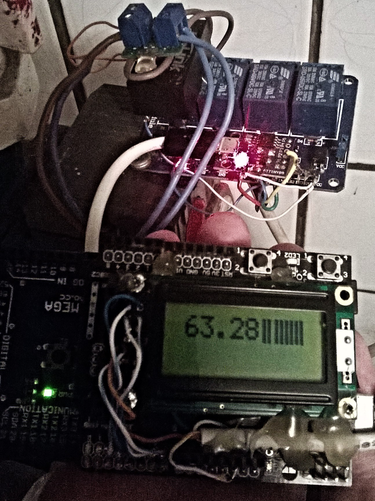

+++
date = "2017-2-21"
tags = ["C", "arduino"]
rss = "I lost my interest in making things with Arduino due to an ugly Arduino ide, debugging frustrations and lack of easy options for deploying what I make. The Digisparck saved the day, and I made a regulator for my home heat exchanger."
+++

# Building  with Arduino and Digisparck

I bought my Arduino about 6 years ago after being impressed with how easy it is to make blinking lights and read a value from a potentiometer, and that was all for a very long time. I lost my curiosity about making anything more complex due to the ugly Arduino ide, debugging frustrations and lack of easy options for deploying what I make, keeping opportunities to load new software and keeping things as simple as possible. Now Digisparck is available, which uses a single Atiny85, giving six output pins and is programmable from USB.

## Arduino and Digisparck

Arduino is now the easiest way to start with digital electronics with good ide, libraries and community. When it came out about 6 or 7 years ago, I remember buying my first mega board for about 50 euros (converting from 38 lats). Now it is available very cheaply on eBay (for example Arduino Uno board costs about five euros). Arduino, however, is very often overkill for my small projects, and I feel bad when I am not utilising thighs with their boundaries. Thus when I heard about Digisparck, I was eager to try it.

Digisparck is basically an Attiny85 (about 1.15 euros) with an easily programmable interface over USB and a voltage regulator on a single chip. It has six output/input pins with which you can attach I2C devices (with SDA un SCK pins) and analogue input devices for controlling relays. The port mapping for Digisparck is as follows:

| Digital | Analog | Other |
| ------- | ------ | ----- |
| P0      | -      | SDA   |
| P1      | -      | -     |
| P2      | A1     | SCK   |
| P3      | A2     | -     |
| P4      | A3     | -     |
| P5      | A0     | Reset |

Also, it can count time but with a precision of 5 minutes in 24 hours with its 8-bit clock, and you can make logic in its 8 kb internal memory with 512 bytes of RAM. It is cheap (about 1.30 euros) and conveniently small, so I have no worries about making my deployable application small and practical looking.

But with such simplicity also comes sacrifices. Due to small memory and RAM, some Arduino libraries do not fit these constraints. Fortunately for many of them, analogue versions of libraries for attiny85 exist developed by makers of Digisparck, allowing to use of many Arduino programs with simple replacements in a header file. 

A significant limitation with Digisparck is being unable to debug your code easily as there is no serial monitor as Arduino does. The situation might look even as desperate as the code:

``` 
void Blink(byte led, byte times){ // poor man's GUI
  for (byte i=0; i< times; i++){
    digitalWrite(led,HIGH);
    delay (400);
    digitalWrite(led,LOW);
    delay (175);
  }
}
```
Fortunately, solutions like emulating a Serial port or Arduino USB device are available, which I will show here. Limitations like these are the ones I like to push creatively, and you will find something in Debugging section.

## Makefile

### Arduino

While usual, Arduino ide is good for seeing out what's possible with Arduino; it is frustrating not typing programs in your way. Fortunately, many felt the same way; thus, the community makes a makefile for Arduino. A very good introduction to how to use it can be found in a [Hackaday blog post](http://hackaday.com/2015/10/01/arduino-development-theres-a-makefile-for-that/). Here I will outline how I use it with a system which had been configured with
```
sudo apt-get install python-serial arduino-mk
```

Before I can compile code, I need to set up a project directory. I have a Tools directory where I store custom code uploaders and Arduino makefile, thus making my projects less dependable on the system I use and subproject directories. In those, I have a `libs` folder, simple makefile and Arduino sketch file `.ino`. A cleaned-up tree from my projects directory looks as follows:
```
├── Tools
│   ├── Arduino.mk
│   ├── micronucleus-t85
│   │   ├── commandline
│   │   │   ├── Makefile
│   │   │   ├── micronucleus
│   │   │   ├── micronucleus.c
├── Blink
│   ├── ATtinyBlink.ino
│   ├── build-attiny
│   ├── build-mega
│   ├── Makefile
├── DebugShield
│   ├── build-mega
│   ├── DebugShield.ino
│   ├── libs
│   │   └── SoftwareSerial
│   └── Makefile
├── DebuggingCDC
│   ├── build-attiny
│   ├── libs
│   │   └── DigisparkCDC
│   ├── Makefile
│   ├── Print.ino
│   └── readme.org
├── SmartRheostat
│   ├── build-attiny
│   ├── libs
│   │   └── SendOnlySoftwareSerial
│   │       ├── keywords.txt
│   │       ├── SendOnlySoftwareSerial.cpp
│   │       └── SendOnlySoftwareSerial.h
│   ├── Makefile
│   └── SmartRheostat.ino
```

The full power could be demonstrated in my `DebugShield` project, which depends on the `SoftwareSerial` library (where Arduino versions can be found in `/usr/share/arduino/libraries` with examples in `/usr/share/arduino/examples`); thus, my makefile for this project is
```
BOARD_TAG = mega

USER_LIB_PATH+=./libs
ARDUINO_LIBS += SoftwareSerial

include ../Tools/Arduino.mk
```
which allows to compile and upload with a single command `sudo make upload,` and afterwards allows to see the serial output in a terminal with `make monitor` in screen environment (to exit it `Ctrl-a k`). 

### Digisparck

Microcontrollers (as attiny85) are usually programmed with ISP programmers, which requires taking the microcontroller out and putting it on the programmer. Thus limiting options to adjust your deployed application. There are two simplifications which are possible in this working setup. The first is to program attiny85 directly from USB, and the second is adding a USB port to your project.

Attiny85 does not have a USB interface to program it; thus, a workaround is to initially burn the startup program (bootloader) with ISP, which would listen to the USB programmer, and then every time you burn program attiny85 over USB, you automatically add bootloader for being able to program on next time. Thus the basic formula for Digisparck is
```
Digisparck = attiny85 + bootloader + USB port. 
```

The bootloader which is burned with Digisparck is [Micronucleus](https://github.com/micronucleus/micronucleus). It takes about 1.5 kb of precios attiny85 memory and adds a 5-second delay (adjustable) when Attiny listens to the USB micronucleus uploader until it enters in user application. Except for having to reattach the digipack to USB every time one wants to program it, the user experience can be the same as with Arduino makefile. 

When a micronucleus burner is installed on the system, the following Makefile should work:
```
BOARD_TAG    = attiny
USER_LIB_PATH+=./libs
ARDUINO_LIBS += SendOnlySoftwareSerial

ALTERNATE_CORE_PATH = ../Tools/digispark
ARDUINO_CORE_PATH = ../Tools/digispark/cores/tiny
ARDUINO_DIR = ../Tools/digispark
MCU = attiny85
ISP_PROG = micronucleus
#ISP_PROG = ../Tools/micronucleus-t85/commandline/micronucleus
F_CPU = 16000000L
```
To use it, do `sudo make upload` and attach your Digisparck device. But before uploading, *check if the application does not exceed 6 kb;* otherwise, the Micronucleus bootloader will be pushed out and thus no longer be able to program the device over USB until it is burned back with the ISP programmer.

There are, however, rough edges with both makefiles for Arduino and Digisparck. For the Arduino makefile, I have to install Arduino while I need only a very small part of that beast. For the digipack makefile, I have to install the micronucleus system-wide, which is not available from standard Ubuntu repositories where. I tried to use Micronucleus from my Tools folder, but it did not work. These are, however, very small issues compared to the problems it solves - being able to use your own editor and a consistent environment between Arduino and Digisparck development, except for debugging.

## Debugging

When I want to debug Arduino code, I add `Serial.println("My debug message")` statements everywhere in the code and listen to them on my computer with `make monitor`. This functionality is supported by a microcontroller, which Arduino uses (the UART protocol) and an onboard adapter, which translates Serial pins (TX and RX) to a USB device. Neither of these is available on Digisparck. Thus, it gets very interesting how I can debug my projects. 

### DigiUSB

While, as I said, one can use a single led to see if one gets the correct value from sensors, it is also possible to put a USB Arduino emulator on attiny85 what [DigiCDC](https://github.com/digistump/DigistumpArduino/tree/master/digistump-avr/libraries/DigisparkCDC) library does. The drawback of this approach is that it takes about 2.5 kb of precious Attiny's memory, and I couldn't get it to work. But it is such a fantastic solution that I couldn't mention.

For printing serial output with Digisparck, it should be possible to use the library simply in the following manner:
```
#include <DigiCDC.h>
void setup() {                
  // initialize the digital pin as an output.
  SerialUSB.begin(); 
  /*
  remember the SerialUSB starts as soon as you call begin 
  and doesn't restart the board when you open the serial monitor 
  (like the uno does) - so if you print to it and you don't 
  have a serial monitor open that text is lost.
  */
}
// the loop routine runs over and over again forever:
void loop() {

   //SerialUSB.println(F("TEST!")); //wrap your strings in F() to save ram!
   SerialUSB.println("TEST!"); //wrap your strings in F() to save ram!

  //   SerialUSB.delay(10);
   /*
   if you don't call a SerialUSB function (write, print, read, available, etc) 
   every 10ms or less then you must throw in some SerialUSB.refresh(); 
   for the USB to keep alive - also replace your delays - ie. delay(100); 
   with SerialUSB.delays ie. SerialUSB.delay(100);
   */
}
```
When this program is burned into Digisprack, my computer recognises it as Arduino serial device and allows me to use `make monitor`. However, I couldn't see printed messages in it. Apart from that, it is such extraordinary work by developers! 

## SendOnlySoftwareSerial

A much simpler solution is to use a SoftwareSerial library from Arduino, where I did not need a receiving function. Thus to get out most juice of attiny85, I use [SendOnlySoftwareSerial](http://gammon.com.au/Arduino/SendOnlySoftwareSerial.zip) library. It uses 1.5 kb for the simplest hello world example, but I have seen it reduce to 0.5 kb when I used the TinyWire library. An example that I used is for my rheostat project:
```
#include <SendOnlySoftwareSerial.h>

SendOnlySoftwareSerial mySerial (3);  // Tx pin
int sensorPin = 1; 
int ledpin = 1;

void setup() {
  mySerial.begin(9600);
  pinMode(ledpin, OUTPUT);
}

void loop() {
  delay(1000);

  int reading = analogRead(sensorPin);
  // converting that reading to voltage, for 3.3v arduino use 3.3
  float voltage = reading * 5.0;
  voltage /= 1024.0; 
     
  // now print out the temperature
  float temperatureC = (voltage - 0.5) * 100 ;  //converting from 10 mv per degree wit 500 mV offset *
  //to degrees ((voltage - 500mV) times 100) 
  mySerial.println(temperatureC);

  if (temperatureC<65.) {
    digitalWrite(ledpin, LOW);
    return;
  }

  if (temperatureC>70.) {
    digitalWrite(ledpin, HIGH); 
    return;
  }
    
}
```
I initialise digital pin 3 as an output for a serial accessible from the Digisparck USB port. Thus only a device which would listen to serial output is needed. (Here, one can also see the most confusing aspect of Digisparck programming is that analogue input pins are enumerated differently from digital ones.) 

## Debugger with Arduino

To get serial output understandable to my pc, I use Arduino for message redirection. Because its Arduino, I also add an LCD display for seeing the state, and thus my serial to USB adapter is as follows:
```
#include <LiquidCrystal.h>
#include <SoftwareSerial.h>

SoftwareSerial mySerial(13, 12); // RX, TX
LiquidCrystal lcd(7,6,5,4,3,2);

String inputString = "";         // a string to hold incoming data
boolean stringComplete = false;  // whether the string is complete201~

void setup() {
  inputString.reserve(200);

  // set up the LCD's number of columns and rows:
  lcd.begin(8, 2);
  // Print a message to the LCD.
  lcd.print("hello, world!");

  Serial.begin(9600);
  while (!Serial) {
    ; // wait for serial port to connect. Needed for native USB port only
  }
  Serial.println("Goodnight moon!");
  // set the data rate for the SoftwareSerial port
  mySerial.begin(9600);
  mySerial.println("Hello, world?");
}

void loop() {

  if (stringComplete) {
    lcd.setCursor(0,0);
    lcd.print(inputString.substring(0,8));

    if (inputString.length()-2 > 8) {
      lcd.setCursor(0, 1);
      lcd.print(inputString.substring(8,inputString.length()-2));
    }
    inputString = "";
    stringComplete = false;
  }

  if (mySerial.available()) {
    char inChar = (char)mySerial.read();
    Serial.write(inChar);
    inputString += inChar;
    if (inChar=='\n') {
      stringComplete = true;
    }
  }
  if (Serial.available()) {
    mySerial.write(Serial.read());
  }
}
```
This code allows me to use Arduino pin 13 for receiving messages from my Digisparck.



In the picture is my Digisparck project, where a debugger can be seen in use showing sensor value (temperature). Particularly in this project, I read the temperature from my firewood boiler, which starts or stops the water pump to extend burning time, burn at optimal temperature and reduce electricity costs. 

## Developing and Deploying

Once my Digisparck project is ready, I must think about the power supply. As the voltage regulator is on top of Digisparck, you can attach it to a 9V battery which should work fine for some days, depending on how you save power. I use old phone chargers for always-on projects, which convert power efficiently even when the power output is as tiny as 0.1 W. 

A common thought that modern electronic chargers (like phones, laptops, etc...) should be detached from electricity to be greener is based on something other than research. The energy waste is very insignificant compared to waste you probably get from electricity-attached microwaves, ovens or blenders due to very cheap powering like [230v-ac-to-5v-dc-converter-lossless]([http://electronics.stackexchange.com/questions/41938/230v-ac-to-5v-dc-converter-lossless][Non-isolating Zener supply]) and a good discussion can be found on [reddit](https://www.reddit.com/r/explainlikeimfive/comments/45om7h/eli5_ive_heard_that_leaving_wallphone_chargers/). But for projects where I am using relays (as above) I have found that HLK-PM01 is a great value which on eBay available for 2.5 euro and is easy to solder in my projects.
