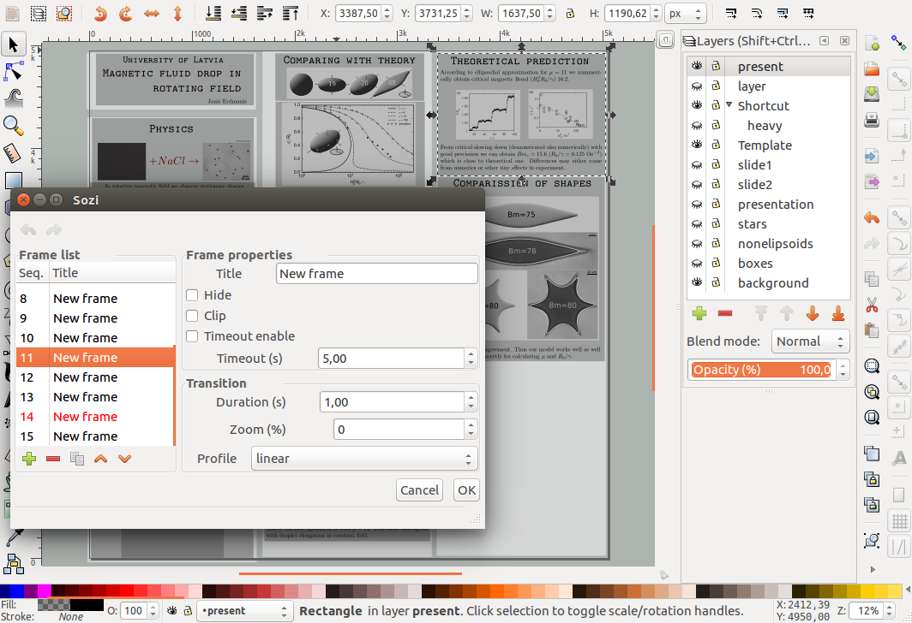
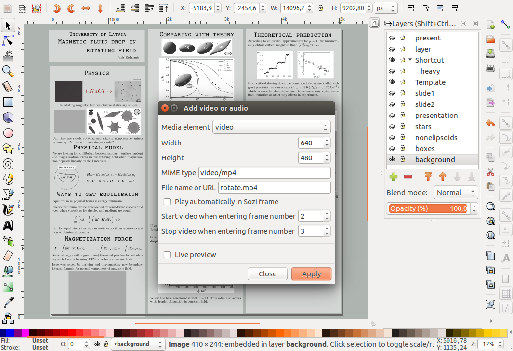

+++
date = "2017-02-17"
rss = "About six months ago, I came into difficulties while making a presentation with LibreOffice and started exploring alternatives like LaTeX Beamer and ipe. However, due to some bugs and limitations, I eventually turned to Inkscape, the best vector graphics editor on Linux, widely used by physicists for figure editing. A Sozi plugin allows to create a single-page poster-like layout and specify regions for each slide, resembling a whiteboard to organise thoughts and ideas."
tags = ["research", "inkscape", "linux", "ffmpeg"]
+++

# Making presentations with Inkscape

About half a year ago, I was in trouble for making a presentation at a seminar talk. I had experienced strange bugs with LibreOffice, which I was trying to get rid of. I had also tried to use latex beamer templates, but I could not stand the empty spaces and misaligned pictures. For a time, I thought I had a solution with [ipe,](http://ipe.otfried.org/) designed for scientific drawing and could edit multipage pdf documents (created by ipe only) and is deeply integrated with latex. Unfortunately, I did experience some click object bugs, which made usage of it irritating. Eventually, I gave Inkscape a second look.

Inkscape is the best vector graphics editor on Linux, which is widely used in physics for [figure making](http://physics.stackexchange.com/questions/401/what-software-programs-are-used-to-draw-physics-diagrams-and-what-are-their-rel) but requires you to use an extension for including latex formulas and takes
a bit of time until you learn how to make it useful (which I also now use extensively). Since in presentations, I use the same editing capabilities, I thought about using them also for my presentations. And I found two options - Jessylink and Sozi. With Jessylink, it is possible to create traditional-looking presentations which convert layers to slides which is a good option, but Sozi offered something better.

In Sozi, you create a single page first, like a poster and then specify regions on which to look on each slide. I look at it as a big whiteboard on which you do organise your thoughts and then try to use them with a stick. The essentials of how I make presentations can be seen in a following image:



## Using LaTeX for formulas and text

The first thing to note is that `.svg` specification does not support flowed text (breaking into lines); thus, LaTeX must be used for making also text content. The default LaTeX way of including LaTeX content `Render/LaTeX` gives good results but does not allow to edit the content after it is created. Thus not suitable for writing long formulas and text. A better option is [Tex Text](https://pav.iki.fi/software/textext/).

With Tex Text, I am able to use my own LaTeX preamble, which is very helpful in setting the width for the text and solving shortcomings of SVG specification. Also, I can use my own macros, which becomes useful when you do copy formulas from your paper. Thus, I copied out my preamble from paper and used it in Tex Text which, for my own good, I paste here:

```
    \usepackage{bm}
    \usepackage[papersize={4.0in, 6.2in},total={3.9in, 6.0in}]{geometry}
    % \renewcommand{\normalsize}{\fontsize{12}{12}\selectfont}
    % \DeclareMathSizes{12}{7}{5}{5}

    {\XXint\displaystyle\textstyle{#1}}%
    {\XXint\textstyle\scriptstyle{#1}}%
    {\XXint\scriptstyle\scriptscriptstyle{#1}}%
    {\XXint\scriptscriptstyle\scriptscriptstyle{#1}}%
    \!\int}
    \def\XXint#1#2#3{{\setbox0=\hbox{$#1{#2#3}{\int}$}
    \vcenter{\hbox{$#2#3$}}\kern-.5\wd0}}
    \def\ddashint{\Xint=}
    \def\dashint{\Xint {\boldsymbol -}}
    \let\vec\boldsymbol
```

## Making presentation more livelly with videos

Sozi also offers an opportunity to insert videos in SVG documents making a presentation more lively. Usually, it comes in handy with downloading content cropping out some specific parts and speeding them up and converting to `.mp4,` which the web browser can understand. While for the first part, I recommend checking out [youtube-dl](https://rg3.github.io/youtube-dl/) and finding straightforward resources on how to use it on the internet. For the second part, I will briefly review usage for the `ffmpeg` converter. 

For cutting out a video from the 1st to the 39th second of the input video use:

```
ffmpeg -i input.mp4 -vf trim=1:39 output.mp4
```
for speeding up the video 10 times and setting the output frame rate to 60 do:
```
ffmpeg -i input.mp4 -r 60 -vf setpts=0.1*PTS output.mp4
```
and to crop specific parts of a video use:
```
ffmpeg -i input.mp4 -vf crop=outw:outh:x:y output.mp4
```
where `outw`, `outh` is the width and height of cropped region and `x`, `y` is the top left corner of the cropping region. The actions above are not limited to mp4 alone. For example, `.avi` and `.org` formats are also supported. Also, it is possible to nest these actions in a single line by adding multiple `-vf` arguments in a single line.

The last step is ensuring that the video is playable by a browser. For avi file I do conversion with a command:

```
ffmpeg -i input.avi -acodec libfaac -b:a 128k -vcodec mpeg4 -b:v 1200k -flags +aic+mv4 output.mp4
```
which gives me a browser-playable mp4 file. Sometimes mp4 files are not playable in the browser. In that case, I have successfully reconverted them with a code snippet:

```
ffmpeg -i input.mp4 -c:v libx264 -crf 23 -preset medium -c:a aac -b:a 128k -movflags +faststart -vf scale=-2:720,format=yuv420p output.mp4
```
which I found somewhere on the internet.

When you have a video in proper mp4 format, you can use it in presentation with the Sozi plugin. Put the video where your SVG file is and add it to your SVG from `Extensions/Sozi Extras/Add video or audio...` where the video with height and path needs to be specified. The video in Inkscape should appear as a grey box which you can place where you need it. The following picture shows it in action:



## Result

Recently I gave a presentation at our local conference, which you can find [here](Conference-2017-feb.svg). Also, since it is a web page, I can embed content in my web page with the following code snippet (Note that for some reason only Firefox can preview it correctly):

```
<embed src="Conference-2017-feb.svg" width=600 height=400 
    style="margin:0 auto; display:block;" type="image/svg+xml">
```
~~~
<embed src="Conference-2017-feb.svg" width=80% height=400 style="margin:0 auto; display:block;" type="image/svg+xml">
~~~
## Some concluding remarks

I envy Mac users with their keynote presentation tool but have never used it, though. On Linux, tools for making presentations are limited, but now I have found peace in letting Inkscape and Sozi make my presentations. However, questions arise if Sozi will still work with later versions of Inkscape as the developer decided to make a [standalone presentation maker](http://sozi.baierouge.fr/pages/20-install.html) but fortunately still hosts the old version.

There are some annoyances with making presentations with Inkscape. The first one is some bug which sometimes makes Inkscape unable to start its extensions (for example, Sozi and Tex Text); thus, some restarts of Inkscape are usual. Another irritation mainly comes from the limitation of
the Inkscape extension model is that it takes too many clicks to add a new slide. Also, videos do not work in Google Chrome; thus, Firefox must be used to show them. These are, however, minor annoyances and take much less time than time to focus on content.

## RESOURCES

- [Some cool presentations made in Sozi](http://sozi.wikidot.com/presentations)
